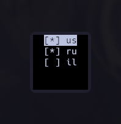

# LanguageChooserHyprland - LCH

---

> [!WARNING]
> Requiers lua config

This projects allows you to dinamicly change list of avalible keyboard layouts in hyprland with a simple TUI.

<p align = center>
  
</p>

## Installation

---

1. Clone repository:
    ```console
    git clone https://github.com/Sevaed/LanguageChooserHyprland.git
    ```
2. Copy  `languages.lua`  into somewhere in yours hyprland config folder.
3. In  `main.py`  modify LANGUAGES_FILE_PATH variable to point on copiedC file.
3. In yours  `hyprland.lua`  on top add:
    ```lua
    local languages = require(<Path_to_languages.lua>) --remove .lua extension from the path
    ```
4. In yours  `hyprland.lua`  at the bottom add:
    ```lua
    hl.config({input={kb_layout=languages}})
    ```
5. Create  `~/.config/LCH_languages.json`  and add needed languages with the following syntax:
     ```json
    ["us","ru","he"]
    ```
7. Copy windowrule from  `windowrule.lua`  into yours  `hyprland.lua` and modify it if you need.
8. Add  `hl.bind("",hl.dsp.exec_cmd("kitty --app-id LCH <path_to_main.py>"))`  into yours  `hyprlan.lua`  and modify it to match yours setup.

## Author words
---
* Sorry for bad english :)
* I created that project just to do something so if there is any bugs i dont know about them because i am not able to actyally use it (I dont need to write anything on something that not english/russian and even if i would want to wrtite smth on hebrew with my very small knowlege of it i dont have hebrew letters on my keycaps).
* Feel free to propose features but remember that i am not good at programming.
